# README Generator

## Description

This project utilizes [Node.js version 16.18.0](https://nodejs.org/en/) and the [Inquirer version 8.2.4](https://www.npmjs.com/package/inquirer) package from [npm, Inc.](https://www.npmjs.com/) to generate a professional README file for any and all projects.

The generated README will include the project's title, description, installation instructions, usage instructions, methods to contribute, the license the application is under, and where questions can be directed. All README files generated will include a table of contents with anchored links to jump from section to section.

In addition, users can designate the filename and a license badge will generate at the top of the README file. The badge will include a link where more information about said license can be read.

## Table of Contents
- [Installation](#installation)
- [Usage](#usage)
- [Credits](#credits)
- [Test Instructions](#tests-instructions)
- [Questions](#questions)

## Installation

Make sure the following are downloaded:

### `Git/GitBash` - *Strongly Recommended*
* While this application can be run using with the default **command prompt**, it is easier to clone this repository by using Git/GitBash, which can be downloaded [here](https://git-scm.com/downloads).

### `Visual Studio Code [VSC]` - *Strongly Recommended*

* If you'd like to make changes to this code or the README file generated, Visual Studio Code is recommended and can be downloaded for free [here](https://code.visualstudio.com/download).

### `Node version 16` - **REQUIRED** to write the README file
* Go to [Node's homepage, https://nodejs.org/en/](https://nodejs.org/en/), then [Downloads](https://nodejs.org/en/download/) and scroll down to the [Previous Releases](https://nodejs.org/en/download/releases/) bullet point. 

* Toggle between the results until the desired version 16 package and click Download. This application was developed with [Node.js version 16.18.0](https://nodejs.org/dist/v16.18.0/), click on [node-v16.18.0-x64.msi](https://nodejs.org/download/release/v16.18.0/node-v16.18.0-x64.msi) to download.

* The Full-Stack Blog also has [instructions on how to download Node](https://coding-boot-camp.github.io/full-stack/nodejs/how-to-install-nodejs).

### `Inquirer version 8.2.4` - **REQUIRED** to prompt questions

* This **MUST** be installed into this repository, start by opening the command line interface.

* If you have Visual Code Studio, add the README Generator repository to the workspace. Then, go to 'Settings' either through the cog icon in the lower left corner and clicking Settings, go to File -> Preferences -> Settings in the menu bar, or the key combo of Ctrl+,

* Then, change the settings in "Terminal: Explorer Kind" to "external" in the drop down menu.

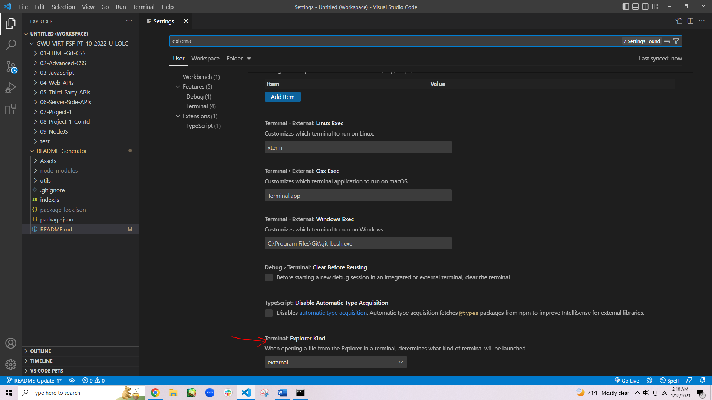
        
* Change the filepath of the "Terminal > External: [respective operating system]" settings to the preferred command line interface program (either your system's Command Prompts's file path or Git/Git Bash's file path)

* After that, right-click the repository and select "Open in External Terminal"

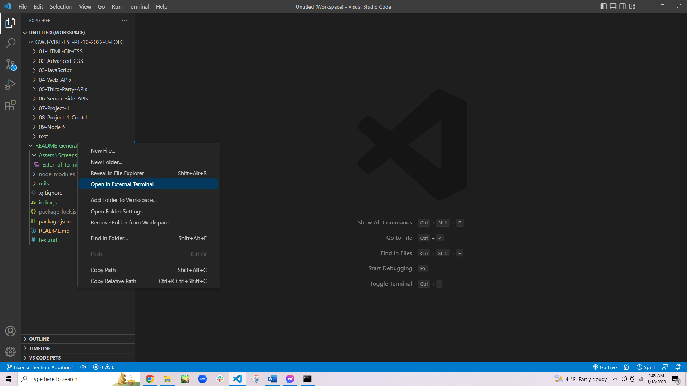

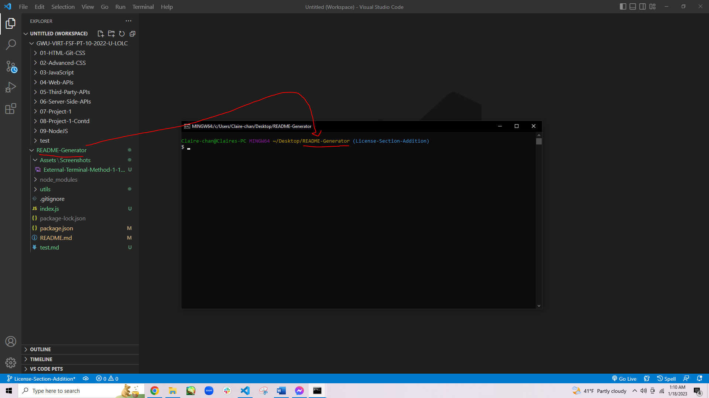

* If you do not have VSC, open the preferred terminal.

* Use "cd Desktop" to first reach the Desktop, cd stands for change directory.

* Continue using "cd" to navigate through the file path to reach the location of this repository on your computer.

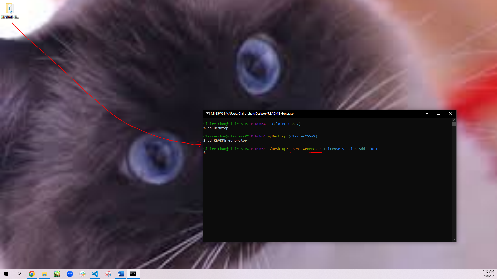

* Once this repository has been reached, type in `npm i inquirer@8.2.4` into the terminal and hit `Enter`.

## Usage

* A video of this application's usage can be viewed [here](https://drive.google.com/file/d/1pbLwfHMrcf_RUMx4d5a3OQEtI1hKC_xq/view). If the link is non-functional, a copy of the video can be found in the "Assets" folder.

* To use this application, start by using either of the two methods described in the [Inquirer v8.2.4 Installation Section](#inquirer-version-824---required-to-prompt-questions) to reach this repository through the preferred terminal.

Method 1:

Method 2:

* Once this repository has been reached, type in `node index.js` into the terminal and hit `Enter`. This will start the questions prompt. Answer the questions as according to the project in question.
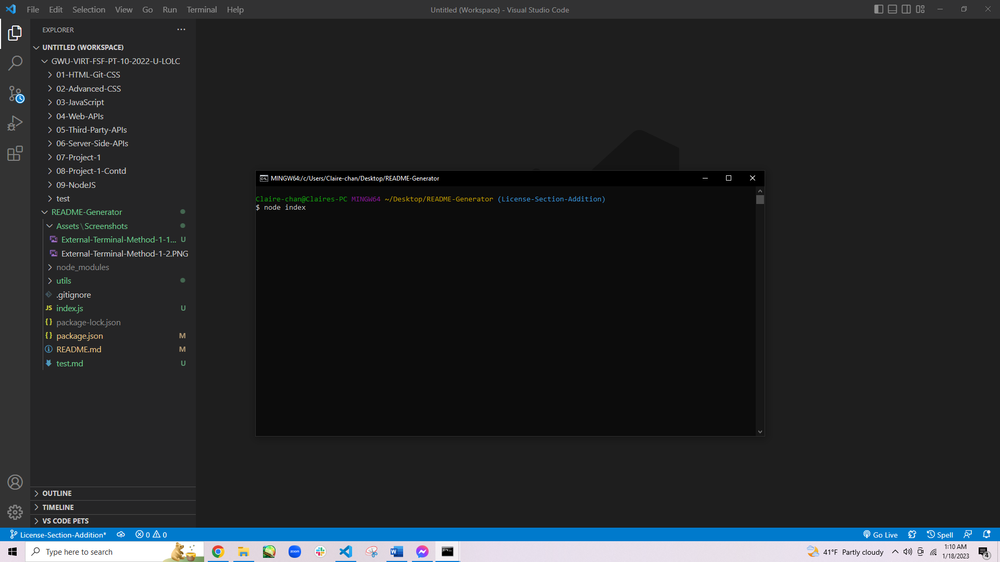

* The first question will determine the markdown file's name, so if the input is `README`, then the file name will be README.md
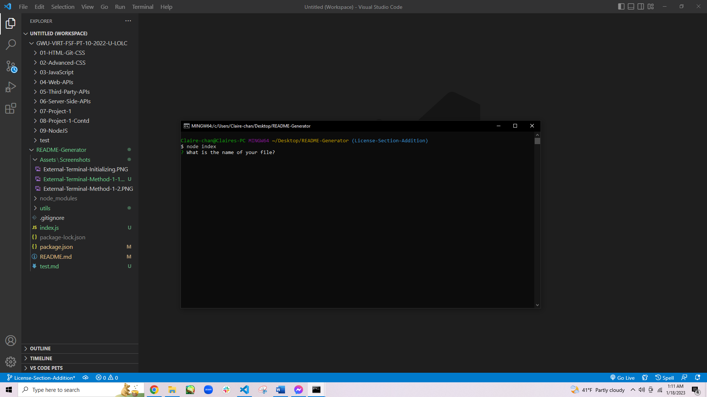

* All questions will be input-based except for those concerning the license and the license badge color, meaning most answers will have to be typed in. Press `Enter` when finished typing. The license and badge color choices can be toggled using the arrow keys and selected with the `Enter` key.
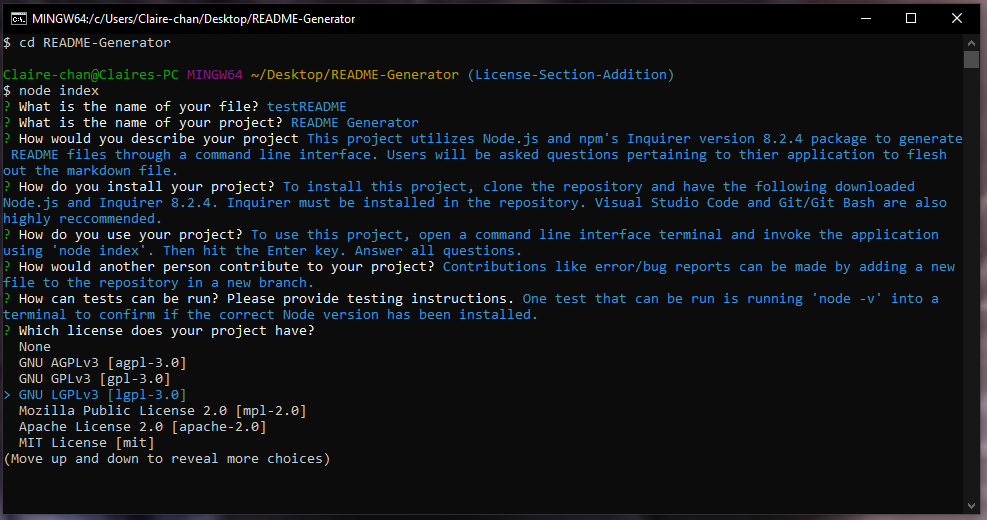
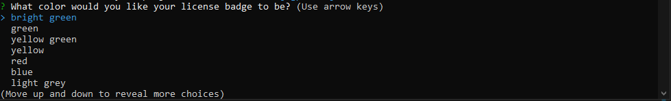
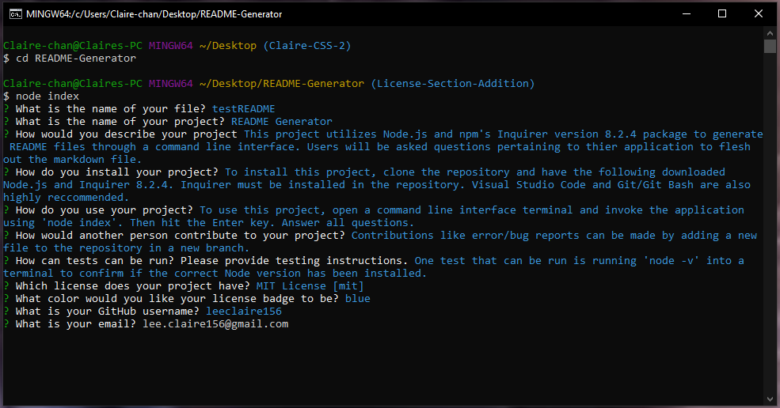

* All proceeding questions will pertain to the markdown file's contents.

* Once all questions have been answered, a README file will generate in the repository with the answered given, and can be edited through Visual Studio Code or any other code/markdown editor.
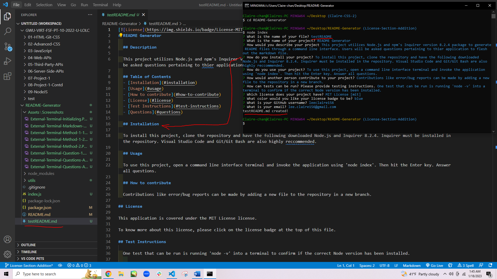

* To learn more about the license chosen, click on the badge that is generated at the top of the README file.
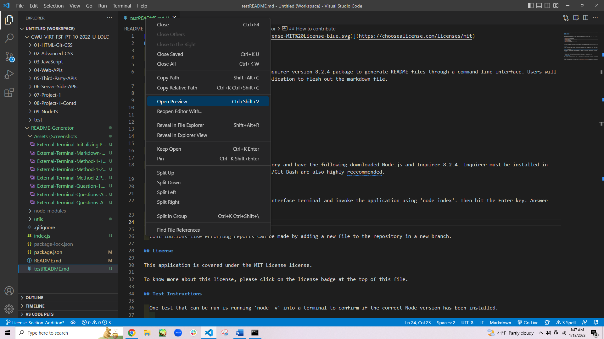
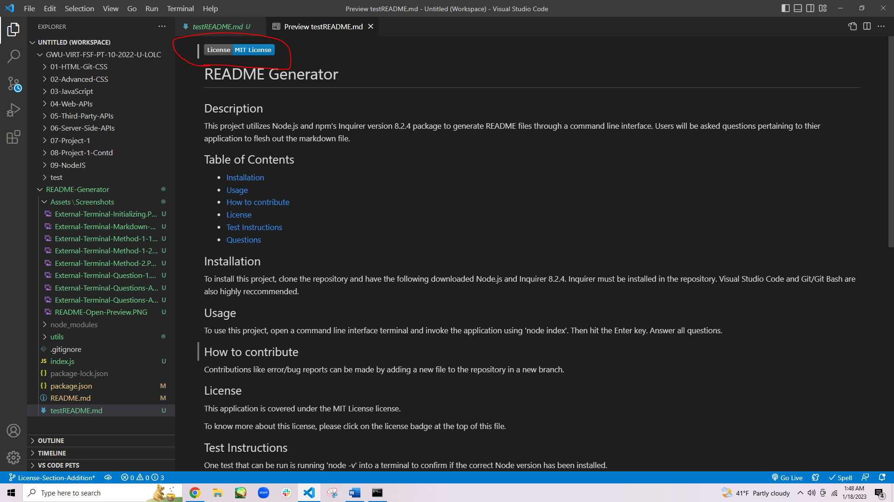
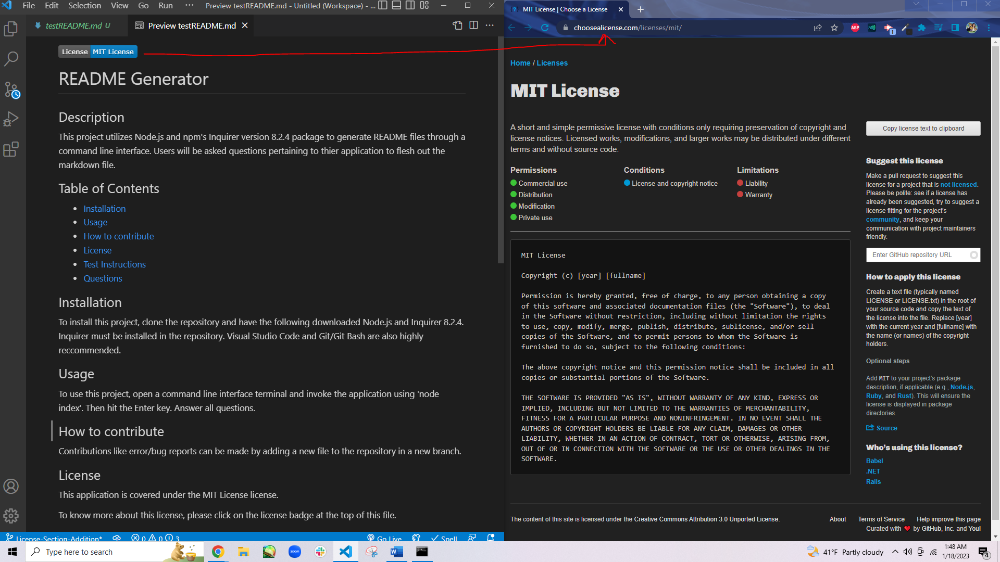

## Credits

* README Outline based on [Request-Response-The Full-Stack Blog's "How to create a Professional README"](https://coding-boot-camp.github.io/full-stack/):  https://coding-boot-camp.github.io/full-stack/github/professional-readme-guide

* Licenses information provided by [Choose a License](https://choosealicense.com/).

* License badge rendering services and format provided by [ShieldsIO](https://shields.io/): https://shields.io/category/license

* Inquirer information provided by [npm](https://www.npmjs.com/):  https://www.npmjs.com/package/inquirer

* Format in markdown file information to email from:  https://agea.github.io/tutorial.md/

* Table of contents anchor link to titles with spaces format provided by [Guillaume](https://community.atlassian.com/t5/user/viewprofilepage/user-id/1164328):  https://community.atlassian.com/t5/Bitbucket-questions/How-to-write-a-table-of-contents-in-a-Readme-md/qaq-p/673363

* Using `include()` method to check if string has a certain character information provided by [Career Karma](https://careerkarma.com/):  https://careerkarma.com/blog/javascript-string-contains/#:~:text=You%20can%20check%20if%20a,designed%20specifically%20for%20that%20purpose

* Using `\n` to make a new line JS to generate new lines in the markup file information provided by [Simplilearn](https://www.simplilearn.com/):  https://www.simplilearn.com/tutorials/javascript-tutorial/javascript-new-line#:~:text=The%20newline%20character%20is%20%5Cn,new%20line%20to%20a%20string.

* Using `split()` method to split string variables information provided by [MDN](https://developer.mozilla.org/en-US/):  https://developer.mozilla.org/en-US/docs/Web/JavaScript/Reference/Global_Objects/String/split

* Using `join()` method to connect string variables information provided by [Geeks for Geeks](https://www.geeksforgeeks.org/):  https://www.geeksforgeeks.org/how-to-remove-spaces-from-a-string-using-javascript/

* Markdown syntax information provided by [WordPress.com](https://wordpress.com/):  https://wordpress.com/support/markdown-quick-reference/

## Tests Instructions

* To see if the correct Node.js version is installed, type `node -v` into the preferred terminal (GitBash or Command Prompt). This should be preferably version 16, but definitely not version 18.

* A test README can be quickly made by running through the questions after typing 'test' for the first question pertaining to the file name.

* Previewing a README file in Visual Studio Code can be done through either right-clicking the README file of interest or right-clicking the README file's opened tab in VSC and selecting 'Open Preview'. Another method is using the following key combination: Ctrl + Shift + V

## Questions
If you have any questions, my GitHub profile is [www.github.com/leeclaire156](www.github.com/leeclaire156), and my email is [lee.claire156@gmail.com](mailto:lee.claire156@gmail.com).